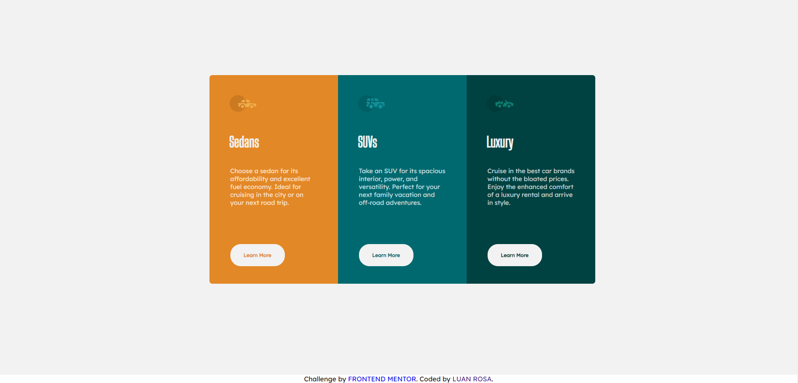

# sirluansier.github.io
# Frontend Mentor - 3-column preview card component solution

This is a solution to the [3-column preview card component challenge on Frontend Mentor](https://www.frontendmentor.io/challenges/3column-preview-card-component-pH92eAR2-). Frontend Mentor challenges help you improve your coding skills by building realistic projects. 

## Table of contents

- [Overview](#overview)
  - [The challenge](#the-challenge)
  - [Screenshot](#screenshot)
  - [Links](#links)
- [My process](#my-process)
  - [Built with](#built-with)
  - [What I learned](#what-i-learned)
  - [Continued development](#continued-development)
- [Author](#author)

# Overview

### The challenge

Users should be able to:

- View the optimal layout depending on their device's screen size
- See hover states for interactive elements

### Screenshot

### Links

- Solution URL: [Solution URL here](https://www.frontendmentor.io/solutions/3column-preview-card-component-solution-HzdxQSLtS)
- Live Site URL: [Live site URL here](https://https://sirluansier.github.io/)

## My process

### Built with

- Semantic HTML5 markup
- CSS custom properties
- Flexbox

### What I learned

I learned how to use Flexbox properties and media query in a better way.

### Continued development

I need to improve my CSS and HTML techniques.

## Author

- GitHub - [SirLuansier](https://github.com/sirluansier)
- Frontend Mentor - [@sirluansier](https://www.frontendmentor.io/profile/sirluansier)
- LinkedIn - [Luan Rosa](https://www.linkedin.com/in/luanrosa-info/)

